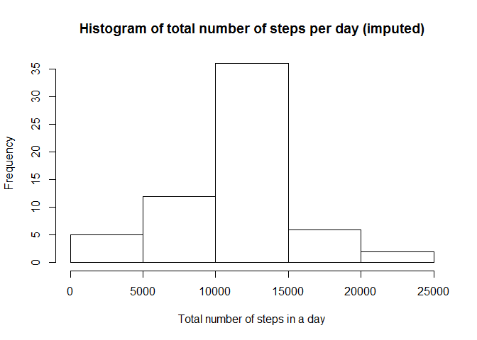

# Reproducible Research: Peer Assessment 1

## Loading and preprocessing the data

```r
library(knitr)
library(dplyr)
```

```
## 
## Attaching package: 'dplyr'
```

```
## The following objects are masked from 'package:stats':
## 
##     filter, lag
```

```
## The following objects are masked from 'package:base':
## 
##     intersect, setdiff, setequal, union
```

```r
library(ggplot2)

opts_chunk$set(echo = TRUE)
```


```r
# Loading the data
read_file <- read.csv("activity.csv")

# Subsetting data which without NAs
clean_data <- subset(read_file, read_file$steps != "NA")
```

## What is mean total number of steps taken per day?
1. Calculate the total number of steps taken per day
2. If you do not understand the difference between a histogram and a barplot, research the difference between them. Make a histogram of the total number of steps taken each day
3. Calculate and report the mean and median of the total number of steps taken per day


```r
# Grouping data by Day
by_day <- group_by(clean_data, date)

# Get total steps by day
steps_by_day <- summarise(by_day, total = sum(steps))

# Histogram of the total number of steps taken each day
hist(steps_by_day$total, main="Histogram of total number of steps per day", 
     xlab="Total number of steps in a day",
     ylab= "Frequency")
```

<!-- -->

```r
# Get the mean and median of the total number of steps taken per day
mean_steps <- as.integer(mean(steps_by_day$total))
median_steps <- as.integer(median((steps_by_day$total)))
```

*The mean of the total number of steps taken per day is 10766.*  
*The median of the total number of steps taken per day is 10765.*

## What is the average daily activity pattern?
1. Make a time series plot (i.e. type = "l") of the 5-minute interval (x-axis) and the average number of steps taken, averaged across all days (y-axis)
2. Which 5-minute interval, on average across all the days in the dataset, contains the maximum number of steps?


```r
# Get total steps by interval
steps_by_interval <- aggregate(steps ~ interval, clean_data, mean)

# Make time series plot
plot(steps_by_interval$interval, steps_by_interval$steps, type='l', 
     main="Average number of steps over all days", xlab="Interval", 
     ylab="Average number of steps")
```

<!-- -->

```r
# Get interval with maximum steps across all days 
max_step_interval <- steps_by_interval[which.max(steps_by_interval$steps),"interval"]
```

*The highest average step count happened during interval 835.*

## Imputing missing values
1. Calculate and report the total number of missing values in the dataset (i.e. the total number of rows with NAs)


```r
total_NAs <- sum(is.na(read_file))
```

*Total number of rows with NA's is 2304*

2. Devise a strategy for filling in all of the missing values in the dataset. The strategy does not need to be sophisticated. For example, you could use the mean/median for that day, or the mean for that 5-minute interval, etc.

**To fill in the NAs with the mean for the 5-minute interval.**


```r
data_imputed <- read_file
for (i in 1:nrow(data_imputed)) {
  if (is.na(data_imputed$steps[i])) {
    interval_value <- data_imputed$interval[i]
    steps_value <- steps_by_interval[
      steps_by_interval$interval == interval_value,]
    data_imputed$steps[i] <- steps_value$steps
  }
}
```

3. Create a new dataset that is equal to the original dataset but with the missing data filled in.


```r
# calculate  total number of steps taken each day
df_imputed_steps_by_day <- aggregate(steps ~ date, data_imputed, sum)
```

4. Make a histogram of the total number of steps taken each day and Calculate and report the mean and median total number of steps taken per day. Do these values differ from the estimates from the first part of the assignment? What is the impact of imputing missing data on the estimates of the total daily number of steps?


```r
hist(df_imputed_steps_by_day$steps, main="Histogram of total number of steps per day (imputed)", 
     xlab="Total number of steps in a day")
```

<!-- -->

```r
# Get mean of the imputed data
mean_imputed <- as.integer(mean(df_imputed_steps_by_day$steps))

# Get median of the imputed data
median_imputed <- as.integer(median(df_imputed_steps_by_day$steps))
```

*The mean total number of steps per day is 10766 and the median is 10766.*  
*The mean is unchanged, but the median moved slightly and is now equal to the mean. Inputting missing data based on an average leaves the average daily total number of steps the same while changing the median.*

## Are there differences in activity patterns between weekdays and weekends?
1. Create a new factor variable in the dataset with two levels - "weekday" and "weekend" indicating whether a given date is a weekday or weekend day.


```r
# Create new variable
data_imputed['type_of_day'] <- weekdays(as.Date(data_imputed$date))

# Define days that are Saturday or Sunday as weekend
data_imputed$type_of_day[data_imputed$type_of_day  %in% c('Saturday','Sunday') ] <- "weekend"

# Define days that are not "weekend" as weekdays
data_imputed$type_of_day[data_imputed$type_of_day != "weekend"] <- "weekday"

# Convert type_of_day from character to factor
data_imputed$type_of_day <- as.factor(data_imputed$type_of_day)
```

Calculate the average weekday steps versus average weekend steps


```r
# Calculate average steps by interval across all days
df_imputed_steps_by_interval <- aggregate(steps ~ interval + type_of_day, data_imputed, mean)

# Create a quick plot
qplot(interval, steps, data=df_imputed_steps_by_interval,
      type="l",
      geom="line",
      xlab="Interval",
      ylab="Number of Steps (Average)",
      main="Average steps taken Weekends vs. Weekdays",
      facets = type_of_day ~ .)
```

```
## Warning: Ignoring unknown parameters: type
```

<!-- -->
